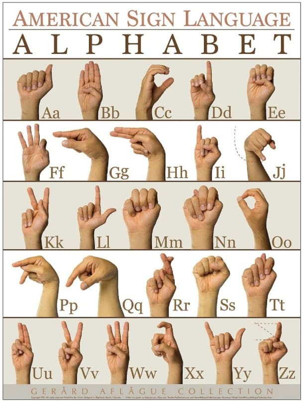

# ASL Language Detection Model

## Description
## Description
This project focuses on building a model to detect American Sign Language (ASL) letters. Initially, the model was a CNN classifier trained to recognize 6 ASL letters. As the complexity increased, I transitioned to using a custom LSTM model with a keypoints approach. 

The project also includes a web app for real-time inference, which is still in development. You can see a demo of the first approach on my [LinkedIn](https://www.linkedin.com/posts/youssef-makhlouf-608aa622a_deployment-ai-machinelearning-activity-7154398378850762752-nfRJ?utm_source=share&utm_medium=member_desktop) link.

## Approach
- **Data Collection**: Collected ASL data using Mediapipe to extract keypoints for hand gestures.
- **Model Architecture**:
  - **Phase 1**: CNN classifier for 6 ASL letters.
  - **Phase 2**: Custom LSTM model, using keypoint data to handle the complexity of additional letters.
- **Model Training**: The model was trained and tracked using MLflow for experiment tracking.
- **Testing**: Real-time ASL detection was tested after training.

## Tools & Technologies
- **Mediapipe**: Used for keypoints extraction.
- **MLflow**: Used for model tracking during training.
- **Jupyter Notebook**: The entire model was developed and tested within a Jupyter notebook.

## Usage
To use the model, follow the steps in the provided Jupyter notebook to train and test on your own ASL dataset.

U can find the keypointsapproach model on checkpoint folder to test ( still in progess) 

## Future Enhancements

- Collecting more data to avoid overfitting.
- Hyper-tuning the model for better performance and accuracy.

## License
[MIT License](LICENSE)
